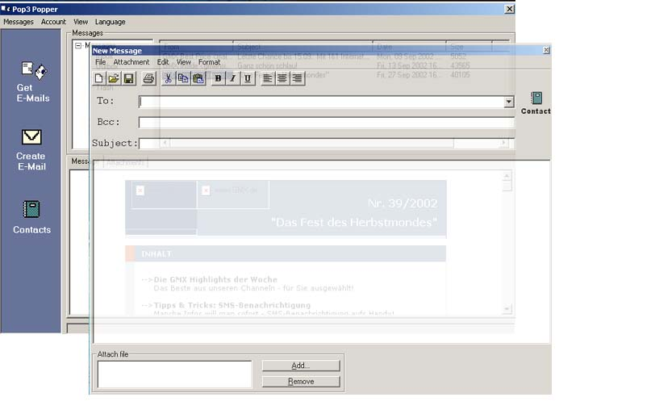



## E\-Mail Programm

### Description

7.528 Lines of Code + 2721 Lines of Comments=10.249 Lines of Code

Complete E-MAil Suit

Features:

-Send E-Mail with multi attachments, HTML formated ...

-Receive E-Mails with multi attachments and DECODE them

-All E-Mails are stored in an Access Database (including the Attachments)

-No OCX for decoding, encoding Mime compatible mails

-No Winsock.ocx uses pure API Calls!

-Complete Adressbook for all your adresses

-Multi language (English, German)

-Clear and structured code

-Speed optimised
 
### More Info
 
Please report any bug!

             |
---                |---
**Submitted On**   |2002-09-24 13:29:40
**By**             |[Sebastian Fahrenkrog](https://github.com/Planet-Source-Code/PSCIndex/blob/master/ByAuthor/sebastian-fahrenkrog.md)
**Level**          |Advanced
**User Rating**    |4.9 (192 globes from 39 users)
**Compatibility**  |VB 6\.0
**Category**       |[Complete Applications](https://github.com/Planet-Source-Code/PSCIndex/blob/master/ByCategory/complete-applications__1-27.md)
**World**          |[Visual Basic](https://github.com/Planet-Source-Code/PSCIndex/blob/master/ByWorld/visual-basic.md)
**Archive File**   |[E\-Mail\_Pro1375209282002\.zip](https://github.com/Planet-Source-Code/sebastian-fahrenkrog-e-mail-programm__1-39329/archive/master.zip)

